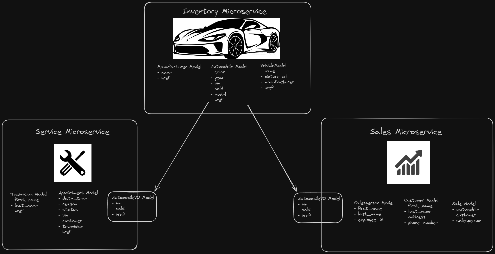

# CarCar

Team:

- Jeff Balagosa - Service Microservice
- Doruk Hacioglu - Sales Microservice

## How to run this app

- Clone the repository.
- Run `docker volume create beta-data` from the root directory.
- Run `docker-compose build` from the root directory.
- Run `docker-compose` up from the root directory.

## Testing

- Files to fascilitate testing can be found in the [shared_resources/](./shared_resources/) directory.

## Diagram

## API Documentation

### URLs and Ports

- React Front-End: http://localhost:3000/
  ​

### Inventory API (Optional)

- Put Inventory API documentation here. This is optional if you have time, otherwise prioritize the other services.

### Service API

- Put Service API documentation here
  ​

### Sales API

- Put Sales API documentation here

## Value Objects

- Identification of value objects for each service goes here
